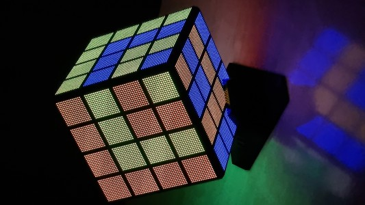

# Hexaturion

Hexaturion offers a graphical user interface for controlling the LED cube
(led-hexahedron).

## Commander of the six faces

The name Hexaturion is chosen in analogy with the Roman centurion
(commander of 100 soldiers) and decurion (commander of 10 soldiers).

## Software platform

It is written in Vue 3, in TypeScript and JavaScript.

## How to use

Scan the QR-code that is shown on startup of the cube, or manually start a
client in a web browser:

[http://hexaturion.com](http://hexaturion.com)
